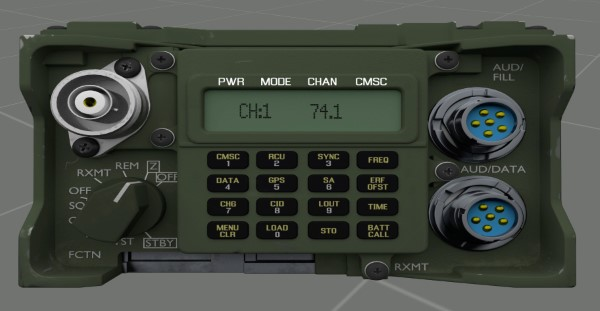
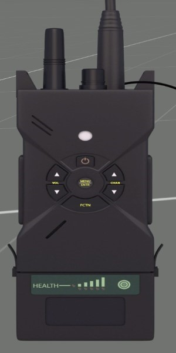
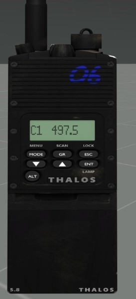
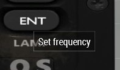

# Communication

How to use the radios, their limits, and how to communicate properly to ensure your message reaches the destination and will be understood by the recipient.

## The Technology of TFAR

Radio specifications and effecting factors.

### The Radio's

|Side| Role | Radio Name | Frequency | Range | Image |
|---|------|------------|-----------|-------|-------:|
|Blue|Infantry | RF-7800S-TR | 30-512MHz | 2 km Range | |
|Blue|Squad Leader | AN/PRC-152 | 30-512 MHz | 5 km Range | |
|Blue| Long Range | RT-1523G | 30-87 MHz | 20 km as Backpack / 30 km when fixed to a Vehicle||
|Blue|Airborne | AN/ARC-210 | 30-87 Mhz | 40 km Range||
|Red| Infantry | PNR-1000A | 30-512MHz | 2 km Range||
|Red|Squad Leader | AN/PRC148-JEM | 30-512 MHz | 5 km Range||
|Red|Long Range|MR3000|30-87 MHz|20 km as Backpack / 30 km when fixed to a Vehicle||
|Red|Airborne|MR6000L|30-87 MHz|40 km||
|Green|Infantry| RF-7800S-TR | 30-512MHz | 2 km Range||
|Green|Squad Leader | AN/PRC-152 | 30-512 MHz | 5 km Range||
|Green|Long Range| RT-1523G | 30-87 MHz | 20 km as Backpack / 30 km when fixed to a Vehicle||
|Green|Airborne | AN/ARC-164 | 30-87 MHz | 40 km Range||

#### Faction Encyrption

A side's/faction's radio can only communicate with another radio of the same side/faction as their data is encrypted.
When you pick up a radio of an hostile player in an PvP environment, you can listen in on their communication with their radio. 

#### The Jamming of the Radio Signal

Within Antistasi, we utilize a feature that comes with TFAR, which creates the simulation of an Jamming Signal.

This means that, if a radiotower is attached to an hostile point of interest, it will start to jam the radio signal within a certain range of it.
The closer you get to that radio tower, the worse the signal strengh and therefore the range of your radio will become.

This affects incoming as well as outgoing transmissions.

#### Signalloss due to the Environment and Terrain

Radio signals work on a "line of sight" basis.

Terrain can block your signal completely, vegetation or constructions can reduce your signal strength and thus your range.

---

### How to Use the Radios

#### Buttons

You open your radio with **L CTRL + P** for the short range versions.

You open your Radio with **L ALT + P** for the long range versions.

This will show you the panel of the radio. Each radio has buttons which will display their function in a tooltip when you hover over them.

With these buttons you can

- Change channels
- Change volume (LMB/RMB)
- Clear frequency
- Set additional channel
- Set frequency
- Set stereo settings of the headset
- Turn switch from headset and speaker

#### Channels

Every radio can store 9 channels. C1 - C9.

Each of this channels has a frequency assigned which you can change on the go.

To Change a Frequency you 
A) Hit **Clear Frequency** - Enter new fequency - Confirm with **Set Frequency**
B) Click on the frequency itself in the display - Enter new frequency - Confirm with **Set Frequency**

The channel selected or seen in the display is the main channel.

The selected main channel is you will use to transmit and recieve radio traffic.

To **Transmit** a message on your short range radio you hold **Caps Lock**.

To **Transmit** a message on your long range Radio you hold **L CTRL + Caps Lock**.

#### Stereo Settings

With the **Stereo Settings** button you can change on which side of your headset the radio communication will be played.

Both sides, left or right.

**It is highly recommended to always seperate your radio communication in an consistant manner**
For example, I always have short range on the left ear and long range on the right ear.

#### Additional Channel

Most radios, with the exception of the rifleman radios, have  to option to also set up an additional channel.

What you do is to set one of your channels as the additional channel. It will show itself as A2: 123 instead of C2: 123.

You can also use the stereo settings for your additional channel to seperate headphone output.

Once you have set up the additional channel, you need to change your main channel to the desired channel.

#### Speaker

You can set your radio to output the radio communication with its built in speaker. This means that people around you can hear what is being said on the frequency.

Doing this as a rifleman in a squad is very bad, as the people around you are already on the same Radio, resulting in earrape.

On the other hand, being the squadleader or dedicated radio operator, it can be a reasonable decision to set your long range radio on speaker to keep people around you updated on what is going on in the battle field.

---
---
---

## Radio Dicipline or how to communicate without causing headaches

### Communication Theroy

The **Sender** has information or order that he wants to deliver to the **Reciever**.

The sender has to **"Encode"** this information in such a way, that the reciever, can **Decode** the message and understand the information as the sender has intendend.

To ensure the receiver has processed the information in an sufficient way, he needs to **give feedback** to the sender so he can **confirm** the message has arrived completely. 

Radio communication can be disrupted by **Noise** during the transmission on the sending or recieving side.

The message can also be disrupted by **Encoding** or **Using the wrong words** and making it difficult for the receiver to **Decode** the message.

This can happen by using unfamiliar words or phrases. By using certain phrases in a wrong manner. By speaking to fast, or by speaking to much.

Interuptive radiochatter on the same network will just increase this disruption.

Therefore it is highly important to send messages with few, well known words and phrases.

### Core concept of Communication applied 

#### Brevity 
It is the art of saying a lot with few words. One must alwys strive to be frugal on the number of words needed to convey a message - there's a lot that needs to be said by many people in a combat sitation.

#### Clarity
In addition to brevity, one must strive to be very clear in their language. This requires the usage of defined tactical language terms, brevity words, a clear and loud voice, and so forth. Articulation and repetition of critical statements is helpful as well.

#### Confirmation and read-back
It's important to confirm that you heard orders, so that leaders know that they are being understood. Additionally, it can be helpful to provide a read back of an order to confirm that you fully understand what is being asked of you. This way the person giving the orders can confirm that you heard them correctly.

#### Alerting and identifying
Alerting is the act of using key words to get the attention of people before you start saying something important. 
For example, a squad leader might say "Squad, listen up!". 

Identifying is the act of saying who you are and who you're trying to contact when speaking over a radio. This reduces confusion and alerts people that someone is attempting to tell them something.
For example, a SQL saying "Alpha, this is Bravo, be advised, you have enemy infantry on your west flank" is utilizing the "alert/identify concept". 

When things are hectic, it's often a good idea to state your callsign and who you are trying to reach, then allow them to answer you when they're able.
Example: "Alpha, this is Bravo" - Waiting until they say "Bravo, this is Alpha, send it" or short "Bravo - send it" before continuing with your full message.

#### Usage of standard operating procedures and tactical language
Being familiar with the standard formats of SITREPs, CASREPs, contact reports, etc, as well as being familiar with the wide range of brevity word and tactical terms, helps to ensure that communication is easy to understand by all involved participants.

---

### Procedures & Rules

#### Alert and Identification & How to Initiate a Call

Regardless of what communication protocol you use, it is importaint to maintain a certain radio procedure to keep things running smooth and organized.

Hearing someone say over the command net "Enemy infantry, bearing 210!" is fairly worthless for people on CommandNet.

**If you are communicating across the radio, you initiate each transmission with who you're talking to, followed by your own callsign, wait for an acknowledgment, and then send your message.** 

####

|Step | Example|
|:---:|---:|
|**Start the call**|*Alpha Squad **for** Command, **how copy**? **Over***|
|**Awnser the Call**|*Command **this is** Alpha, **Send it**! Over*|
|**Message**|*Alpha, **be advised**. Recon spotted hostile infantry SquadSize ahead, Reference farm, **how copy**? Over*|
|**Read Back**|*Alpha **Copies**, Hostile infantry ahead by farm. Over*|
|**Confirm Read Back and end of call**|_**Good Copy**, Command **Out**_|

### Procedure Words

These are the most common "Procedure Words", phrases with a predefined meaning and commonly used in the gaming environment.

Many of these terms will 

This simple procedure keeps the radio comms organized and allows for the various elements to know when they are specifically being talked to.

Not waiting for an acknowledgment often results in a repeated message being requred, since the recieving unit may have been to busy to listen to the message inteded for them.

## Sources

[Official TFAR Wiki // GitHub](https://github.com/michail-nikolaev/task-force-arma-3-radio/wiki/README_EN)

[Communication // Dslyecxi's Tactics, Techniques & Procedures for ArmA 3](https://ttp3.dslyecxi.com/communication/)
    Absolutely Excellent Source of Knowledge

[Common Procedure Words // Wiki](https://en.wikipedia.org/wiki/Procedure_word)

