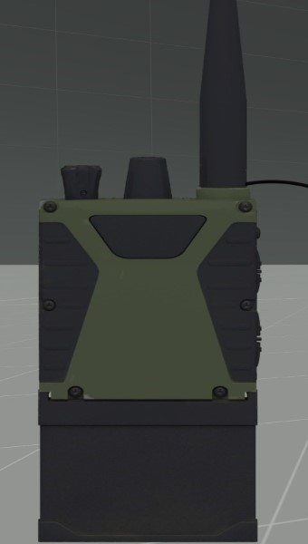
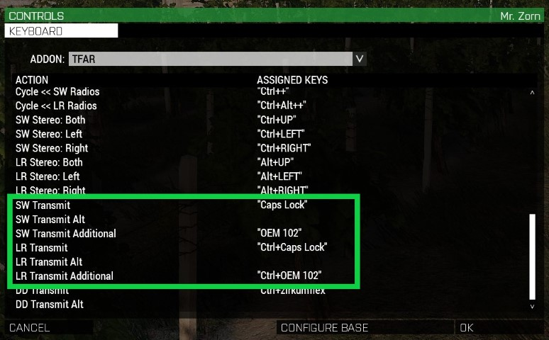
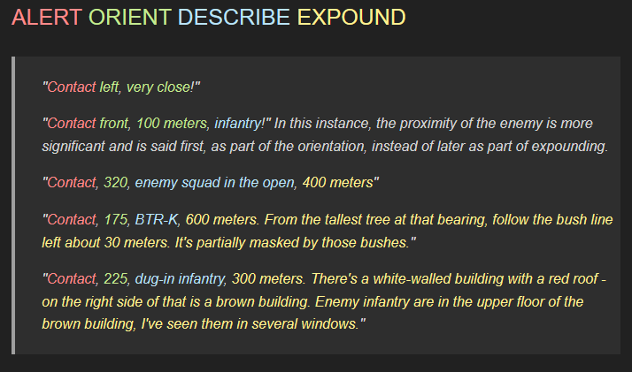

# Communication

How to use the radios, their limits, and how to communicate properly to ensure your message reaches the destination and will be understood by the recipient.

- [Communication](#communication)
  - [The Technology of TFAR](#the-technology-of-tfar)
    - [The Radio's](#the-radios)
      - [Faction Encyrption](#faction-encyrption)
      - [The Jamming of the Radio Signal](#the-jamming-of-the-radio-signal)
      - [Signalloss due to the Environment and Terrain](#signalloss-due-to-the-environment-and-terrain)
    - [How to Use the Radios](#how-to-use-the-radios)
      - [Buttons](#buttons)
      - [Channels](#channels)
      - [Stereo Settings](#stereo-settings)
      - [Additional Channel](#additional-channel)
      - [Speaker](#speaker)
  - [Radio Dicipline or how to communicate without causing headaches](#radio-dicipline-or-how-to-communicate-without-causing-headaches)
    - [Communication Theroy](#communication-theroy)
    - [Core concept of Communication applied](#core-concept-of-communication-applied)
      - [Brevity](#brevity)
      - [Clarity](#clarity)
      - [Confirmation and read-back](#confirmation-and-read-back)
      - [Alerting and identifying](#alerting-and-identifying)
      - [Usage of standard operating procedures and tactical language](#usage-of-standard-operating-procedures-and-tactical-language)
    - [Procedures & Rules](#procedures--rules)
      - [Alert and Identification & How to Initiate a Call](#alert-and-identification--how-to-initiate-a-call)
      - [A Basic Radio Transimssion](#a-basic-radio-transimssion)
      - [Important Messages](#important-messages)
      - [Delivering Grid Coordinates](#delivering-grid-coordinates)
    - [Procedure Words](#procedure-words)
    - [Contact Report](#contact-report)
      - [1 - Alert](#1---alert)
      - [2 - Orient](#2---orient)
      - [3 - Describe](#3---describe)
      - [4 - Expound](#4---expound)
    - [SITREPs](#sitreps)
    - [ACE Reports](#ace-reports)
    - [CASREPs](#casreps)
  - [Sources](#sources)


## The Technology of TFAR

Radio specifications and effecting factors.


### The Radio's

|Side| Role | Radio Name | Frequency | Range | Image |
|---|------|------------|-----------|-------|-------:|
|Blue| Rifleman | RF-7800S-TR | 30-512MHz | 2 km Range | |
|Blue| Squad Leader | AN/PRC-152 | 30-512 MHz | 5 km Range | |
|Blue| Long Range | RT-1523G | 30-87 MHz | 20 km as Backpack / 30 km when fixed to a Vehicle||
|Blue| Airborne | AN/ARC-210 | 30-87 Mhz | 40 km Range||
|Red| Rifleman | PNR-1000A | 30-512MHz | 2 km Range||
|Red| Squad Leader | AN/PRC148-JEM | 30-512 MHz | 5 km Range||
|Red| Long Range |MR3000|30-87 MHz|20 km as Backpack / 30 km when fixed to a Vehicle||
|Red| Airborne |MR6000L|30-87 MHz|40 km||
|Green| Rifleman | RF-7800S-TR | 30-512MHz | 2 km Range||
|Green| Squad Leader | AN/PRC-152 | 30-512 MHz | 5 km Range||
|Green| Long Range | RT-1523G | 30-87 MHz | 20 km as Backpack / 30 km when fixed to a Vehicle||
|Green| Airborne | AN/ARC-164 | 30-87 MHz | 40 km Range||

Rifleman Radios need a DAGR Programmer, found in the watchslot, to reprogram frequencies.

#### Faction Encyrption

A side's/faction's radio can only communicate with another radio of the same side/faction as their data is encrypted.
When you pick up a radio of an hostile player in an PvP environment, you can listen in on their communication with their radio. 

#### The Jamming of the Radio Signal

Within Antistasi, we utilize a feature that comes with TFAR, which creates the simulation of an Jamming Signal.

This means that, if a radiotower is attached to an hostile outpost, it will start to jam the radio signal within a certain range of it.
The closer you get to that radio tower, the worse the signal strengh and therefore the range of your radio will become.

This affects incoming as well as outgoing transmissions.

#### Signalloss due to the Environment and Terrain

Radio signals work on a "line of sight" basis.

Terrain can block your signal completely, vegetation or constructions can reduce your signal strength and thus your range.


---

### How to Use the Radios

#### Buttons

You open your radio with `L CTRL + P` for the short range versions.

You open your Radio with `L ALT + P` for the long range versions.

This will show you the panel of the radio. Each radio has buttons which will display their function in a tooltip when you hover over them.


With these buttons you can

- Change volume (LMB/RMB)
- Change channels
- Clear frequency
- Set frequency
- Set stereo settings of the headset
- Switch from headset and speaker
- Set additional channel


#### Channels

Every radio can store 9 channels. C1 - C9.

Each of this channels has a frequency assigned.

To Change a Frequency you 

A) Hit `Clear Frequency` - Enter new fequency - Confirm with `Set Frequency`

B) Click on the frequency itself in the display - Enter new frequency - Confirm with `Set Frequency`

The channel selected or seen in the display is the main channel.

The selected main channel is you will use to transmit and recieve radio traffic.

To `Transmit` a message on your short range radio you hold `Caps Lock`.

To `Transmit` a message on your long range radio you hold `L CTRL + Caps Lock`.


#### Stereo Settings

With the `Stereo Settings` button you can change on which side of your headset the radio communication will be played.

Both sides, left or right.

**It is highly recommended to always seperate your radio communication in an consistant manner**
For example, I always have short range on the left ear and long range on the right ear.


#### Additional Channel

Most radios, with the exception of the rifleman radios, have  to option to also set up an additional channel.

What you do is to set one of your channels as the additional channel. It will show itself as A2: 123 instead of C2: 123.

You can also use the stereo settings for your additional channel to seperate headphone output.

Once you have set up the additional channel, you need to change your main channel to the desired channel.


**Keybinding**



SW = Handheld - LR = Backpack

Transmit = Main Channel

Transmit Additional = Additional Channel

Transmit Alt = Transmit on Both Main and Additional Channel

Transmit Alt could be only useful if a SquadLead has their fireteams or sections seperated on two different channels and wants to transmit a message to both at once. I personally never used it before, but dont confuse it with Additional.

#### Speaker
You can set your radio to output the radio communication with its built in speaker. This means that people around you can hear what is being said on the frequency.

Doing this as a rifleman in a squad is very bad, as the people around you are already on the same Radio, resulting in earrape.

On the other hand, being the squadleader or dedicated radio operator, it can be a reasonable decision to set your long range radio on speaker to keep people around you updated on what is going on in the battle field.

---

## Radio Dicipline or how to communicate without causing headaches

### Communication Theroy
Basic communcation Theory and how it applies to a Radio Conversation.


The `Sender` has information that he wants to deliver to the `Reciever`.

The sender has to `"Encode"` or *phrase* this information in such a way, that the reciever, can `"Decode"` or *unterstand* the information as the sender has intendend.

To ensure the receiver has processed the information in an sufficient way, he needs to `give feedback` to the sender so he can `confirm` the message has arrived as intended. 

Radio communication can be disrupted by `Noise` during the transmission.

This can be a  disruptice background on the side of sender or reciever, like a firefight, another radio frequency they are listening on or callsigns talking over each other.

The message can also be disrupted by `Encoding` or *phrasing* the Message with `unclear words` and making it difficult for the receiver to `Decode` or *understand* the message.

Using unfamiliar words or phrases in a wrong manner, by speaking to fast, or by simply speaking to long on the radio can lead to the decay of the message.

Therefore it is highly important to send messages with few, well known words and phrases.


### Core concept of Communication applied 
```
Speech is silver, silence is gold!
```
Why not have both?

#### Brevity 
It is the art of saying a lot with few words. One must always strive to be frugal on the number of words needed to convey a message - there's a lot that needs to be said by many people in a combat sitation.

#### Clarity
In addition to brevity, one must strive to be very clear in their language. This requires the usage of defined tactical language terms, brevity words, a clear and loud voice, and so forth. Articulation and repetition of critical statements is helpful as well.

#### Confirmation and read-back
It's important to confirm that you heard orders, so that leaders know that they are being understood. Additionally, it can be helpful to provide a read back of an order to confirm that you fully understand what is being asked of you. This way the person giving the orders can confirm that you heard them correctly.

#### Alerting and identifying
Alerting is the act of using key words to get the attention of people before you start saying something important. 
For example, a squad leader might say "Squad, listen up!". 

Identifying is the act of saying who you are and who you're trying to contact when speaking over a radio. This reduces confusion and alerts people that someone is attempting to tell them something.
For example, a SQL saying "Alpha, this is Bravo, be advised, you have enemy infantry on your west flank" is utilizing the "alert/identify concept". 

When things are hectic, it's often a good idea to state your callsign and who you are trying to reach, then allow them to answer you when they're able.
Example: "Alpha, this is Bravo" - Waiting until they say "Bravo, this is Alpha, send it" or short "Bravo - send it" before continuing with your full message.

#### Usage of standard operating procedures and tactical language
Being familiar with the standard formats of SITREPs, CASREPs, contact reports, etc, as well as being familiar with the wide range of brevity word and tactical terms, helps to ensure that communication is easy to understand by all involved participants.

---

### Procedures & Rules

#### Alert and Identification & How to Initiate a Call

Regardless of what communication protocol you use, it is importaint to maintain a certain radio procedure to keep things running smooth and organized.

Hearing someone say over the command net "Enemy infantry, bearing 210!" is fairly worthless for people on CommandNet.

**If you are communicating across the radio, you initiate each transmission with who you're talking to, followed by your own callsign, wait for an acknowledgment, and then send your message.** 

#### A Basic Radio Transimssion

|Step | Example|
|:---:|---:|
|**Start the call**|*Alpha `for` Command, `how copy`? `Over`*|
|**Awnser the Call**|*Command `this is` Alpha, `Send it`! Over*|
|**Message**|*Alpha, `be advised`. Recon spotted hostile infantry ahead squadsize, reference farm, `how copy`? Over*|
|**Read Back**|*Alpha `Copies`, Hostile infantry ahead by farm. Over*|
|**Confirm Read Back and end of call**|_`Good Copy`, Command `Out`_|

Not waiting for an acknowledgment often results in a repeated message being requred, since the recieving unit may have been to busy to listen to the message inteded for them.

Once a call has been started it occupies the Network. Every other callsign on that network has wait until the call is finished with the Procedure Word OUT.  

#### Important Messages

Only if a sender has an important and urgent message that need to be delivered as soon as possible where any delay would cause harm, he can interrupt a conversation with `Break Break Break`. 

The currently ongoing conversation has to yield. The urgent message needs to be delivered as clear and fast as possible.
|Example|
|---|
|*Alpha to Command, Send SitRep, over!*|
*Command to Alpha, we are ...*|
|`Break Break Break` *Priority Message to Bravo. This is Recon! Enemy Armor heading towards your position! Bravo, how Copy?*|
|*Good copy. Bravo Out!*|
|...|
|*Command to Alpha, we are all men up! ...*|


#### Delivering Grid Coordinates

When delivering Grid Coorinates verbally, the two sets of digits are being seperated with "break"

|Example|
|---|
|*Command to Alpha, Requesting IDF, over!*|
|*Alpha, send it! Over*|
|*TRP Alpha 001 Grid 0545 Break 0636. Over!*|
|*TRP Alpha 001 Grid 0545 Break 0636. Copy!*|
|*Good Copy. Alpha Out*|

### Procedure Words

These are the most common "Procedure Words", phrases with a predefined meaning and commonly used in the gaming environment.

This simple procedure keeps the radio comms organized and allows for the various elements to know when they are specifically being talked to.

|Procedure Word|Meaning|
|---|---|
|Over| This is the end of my transmission to you and a response is necessary - Go ahead: transmit.|
|Out| This is the end of my transmission and no answer is requred or expected.|
|Copy| Standard acknowledgment.|
|Roger| Simple affirmative acknowledgment - You heard message and will comply.|
|Wilco| Short for Will Comply. "Roger Wilco" is redundant.|
|Negative| No - Alternative NEGAT|
|Stand by| This acts as either a wait request or a preparatory command for the squad.|
|Busy| You are busy and cannot pay attention to the radio network |
|Wait| Wait one. - I must pause for a few seconds.|
|Wait - Out| I must pause for longer than a few seconds.| 
|Radio Silence| Typically used by SQL or PTL to let his squad know to be quiet while he CommandNet is active or to get everyone to shut up to listen to faint, distant sounds.|
|Be advised| Used to indicate important information during a radio communication.|
|Break| Indicate the separation between portions of the message|
|Say again| The prior message was not understood|
|Stepped on|Used to tell the last transmitting party that they were talked over by another person.|
|Radio Check| What is my signal strenth and readability? How do you hear me?|
|Loud and Clear| Alternatives: Lima and Charlie, 5 by 5|
|Weak Readable| Weak but readable|
|Weak and Distrorted| unreadable|
|Words Twice| Communication is difficult. Please send every word, or group of words, twice.|
|Unkown Station| The identity of the satation with whom I am attempting to establish communication.|


### Contact Report

A Concat report consist of several key elements that must be presended in a specific order for it to be effective.

#### 1 - Alert
Typically the word `Contact`. This sould be the frist thing when you spot the enemy. Gvies heads up for everyone.

Can also include Warnings like `Close` when they could easily spot your or `Danger Close!` when they are about to step on you.

#### 2 - Orient
* Relative bearing - `Front`, `Left`, `Right`, `Rear` - In a stationary defense, particularly when defending in multiple directions, this is not usable.
* General compass bearing - `North` - `North West`, `North North West`
* Specific compass bearing - `250°` - Used for high-percision reporting when units are fairly close to each other. Compass bearings are usually in Degree.
* Clock bearing - To be used mainly by single vehicle crews since a vehicle has a common `12'o'clock` that all crew members are familiar with.

#### 3 - Describe
What did you see? Was it an enemy patrol, tank or a little old lady? Is it confirmed hostile?
Exmples: `"Unkown Infantry"`, `"Enemy Patrol"`, `"APC"`, `"Machinegun nest"`.

In Antistasi we also need to confirm if the contact you are talking about is hostile, friendly or unkown. 
Simply saying "There is a Tank!" often isn't specific enough.

#### 4 - Expound 

If the target range has not given in the Orient step it must be given here. The Range is essential and loows players to react appropriately to the threat's proximity.

The range can be given at whatever level of detail time allows for, from "Close!" to "523 meters". 

**Range is the most important thing and must always be given.**

If the situtation allows, give more information:
* Specific degree bearing
* What are they doing? They flanking or do they not see us?
* Specific positioning of the target.

Examples



### SITREPs

The situation report, or `SITREP` is a quick way for a leader to get information on their troops.
This can be from Platoon to Squad, from Squad to Fireteam and from Fireteam to the individual Rifleman.

To be responded with their current status, i.e. `All Green`, `Ammo Red`, `In Concact`, `Heavy Casulties`, so on and so forth.

SITREP's are not intended to be incredibly in-depth, unless necessary. When a leader wants a more detailed report, they should aske for an ACE report.

### ACE Reports

An Ammo, Casualities and Equipment report

* `Ammo` if you team is low on ammo, give details on it. This can be in general or more specific.
* `Casualities` State your dead first, then wounded after that. Alternatively, an element can simply reply with how many uints are alive under their command (how many are "up"). Example: "Alpha 2, 3 up, one is wounded".
* `Equipment` If the team has lost any important equipment, for example Anti Tank weapons that have been expended or if an AR has been lost.
  

### CASREPs
The casualty report, or CASREP, is a quick and focused report that is designed so that a leader an quickly find out how many casualities have been taken.

## Sources

[Official TFAR Wiki // GitHub](https://github.com/michail-nikolaev/task-force-arma-3-radio/wiki/README_EN)

[Communication // Dslyecxi's Tactics, Techniques & Procedures for ArmA 3](https://ttp3.dslyecxi.com/communication/)
    Absolutely Excellent Source of Knowledge

[Common Procedure Words // Wiki](https://en.wikipedia.org/wiki/Procedure_word)

