# How to Read the Map and Gain an Advantage

How to orientate yourself, what the map can tell you and how to gain an advantage.

- [How to Read the Map and Gain an Advantage](#how-to-read-the-map-and-gain-an-advantage)
  - [Tools of the Trade](#tools-of-the-trade)
    - [The Map](#the-map)
      - [General](#general)
        - [Different Map Layers](#different-map-layers)
        - [Natural Features (of Military Significance)](#natural-features-of-military-significance)
        - [Manmade Features](#manmade-features)
        - [Points of Reference](#points-of-reference)
      - [Contour Lines of Topographic Maps](#contour-lines-of-topographic-maps)
        - [Hill](#hill)
        - [Ridge](#ridge)
        - [Valley](#valley)
        - [Draw](#draw)
        - [Spur](#spur)
      - [Map Grids](#map-grids)
        - [Grid Coordinates](#grid-coordinates)
        - [Digits](#digits)
        - [Keypad Reference](#keypad-reference)
      - [Grid Vectors](#grid-vectors)
    - [The Map Tools (ACE)](#the-map-tools-ace)
      - [Features of Map Tool](#features-of-map-tool)
        - [Leading Line](#leading-line)
        - [Grid Tool](#grid-tool)
        - [Ruler](#ruler)
        - [Center](#center)
      - [Moving the Map tool](#moving-the-map-tool)
      - [Calculating a Route Between two Points](#calculating-a-route-between-two-points)
    - [The Compass](#the-compass)
      - [Degree](#degree)
      - [Mils](#mils)
    - [GPS, DAGR and MicroDAGR](#gps-dagr-and-microdagr)
      - [GPS (and Drone Terminals)](#gps-and-drone-terminals)
      - [DAGR](#dagr)
      - [MicroDAGR](#microdagr)
    - [Binoculars (ACE)](#binoculars-ace)
      - [MIL-DOT Ranging](#mil-dot-ranging)
    - [Your own Eyes](#your-own-eyes)
      - [Path of the Sun](#path-of-the-sun)
      - [Polaris](#polaris)
  - [Sources and References](#sources-and-references)

---

## Tools of the Trade

### The Map

#### General
##### Different Map Layers

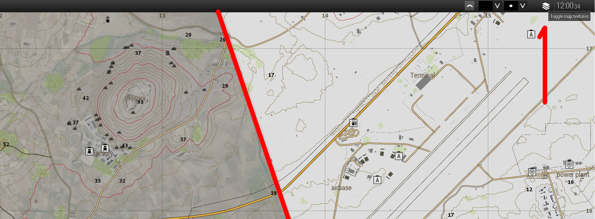

##### Natural Features (of Military Significance)


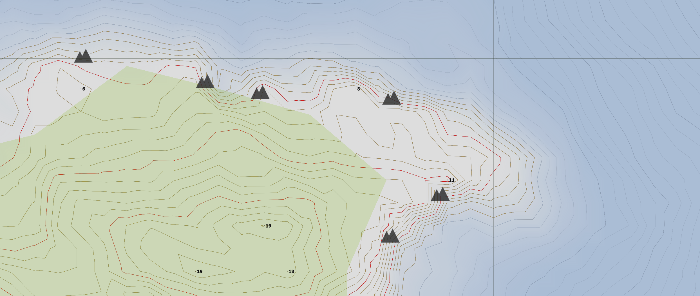

##### Manmade Features

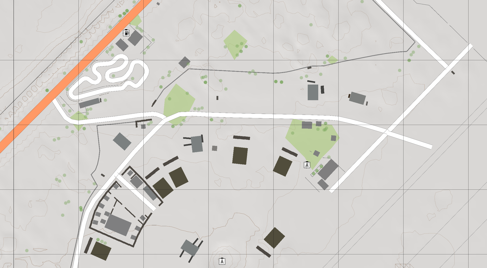

##### Points of Reference

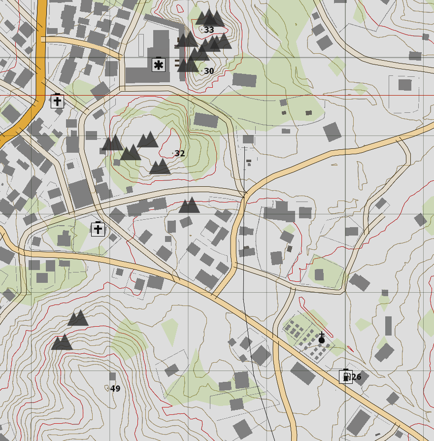

Hospital, Church, Gas Station

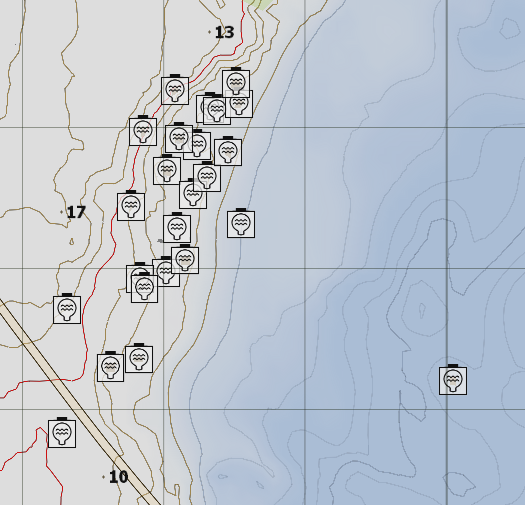

Power Generation, in this case Wave Power

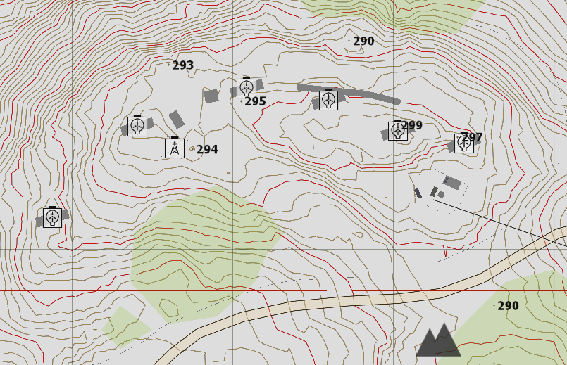

Power Generation via Wind, Communication Tower

#### Contour Lines of Topographic Maps

* Each Line represents a certain height Above Sea Level

* Every fifth line is Red for easier Reading

* It is always helpful to read Terrain from the Highpoint downwards

* When contour lines are closer togehter, this means that the gradient is steep. The closer the lines, the steeper the gradient

* When contour lines are further apart, the terrain is flatter

##### Hill
A point or small area of high ground.
When on a hilltop, the ground slopes down in all directions.


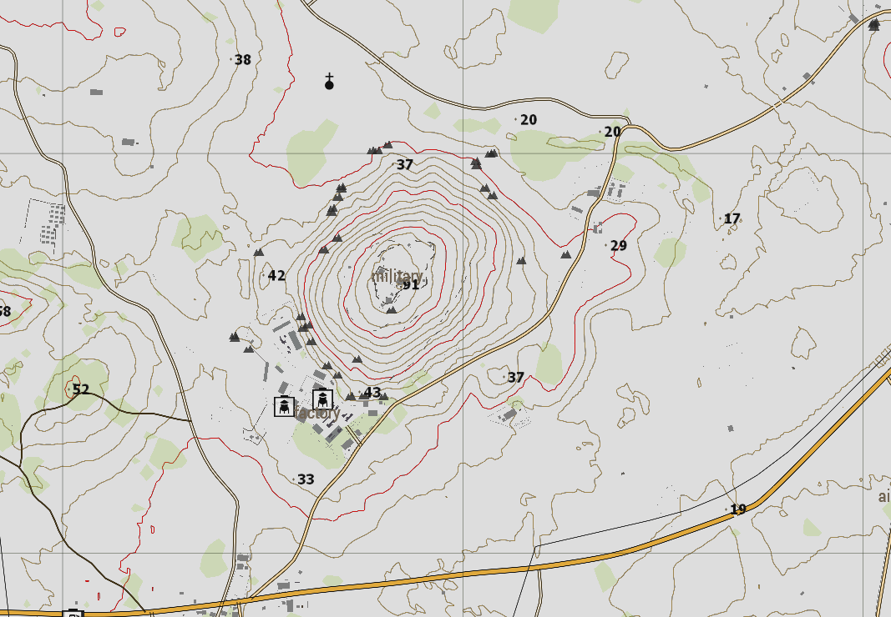

##### Ridge

A line of high ground with height variations along its crest.
The ridge is not simply a line of hills; allpoints of the ridge crest are higher than the ground on both sides of the ridge.


##### Valley

Reasonably level ground bordered on the sides by higher ground which usually has maneurver room within its confines.


##### Draw
Similar to a valley, except that normally it is less developed stream course in which there is generally no level ground and, therefore, little or no maneuver room. The groud slopes upward on each side and toward the head of the draw.


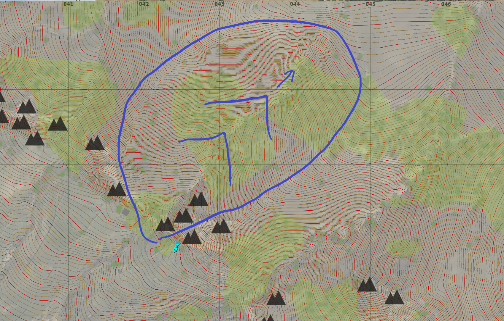


The "Arrow" made by the contourlines on a Draw is pointing **towards** the Highpoint

##### Spur
A usually short, continuously sloping line of higher ground, normally jutting out from the side of a ridge.
A spur could be considered as the high ground that helps create a draw.


The "Arrow" made by the contourlines on a Spur is pointing **away** the Highpoint

---

#### Map Grids

##### Grid Coordinates
Grid Coordinates consists of two sets numbers
Grid Coordinates are always given in the same order: "Read Right, then Up".

First set of numbers designate the longitute, the horizontal distance across the map.
The reference numbers (grids) increase from left to right.

Latitude -  Bottom to Top
Secound set of number designate the latitute, the vertical distance up the map. Bottom to the Top.

When delivering Grid Coorinates verbally, the two sets of digits are being seperated with "break"

##### Digits
The more Digits used, the more accurate a position can be determined.
```
 2 Digits: 0 break 0 = 10000m by 10000m
 4 Digits: 00 break 00 = 1000m by 1000m 
 6 Digits: 000 break 000 = 100m by 100m 
 8 Digits: 0000 break 0000 = 10m by 10m 
10 Digits: 00000 break 00000 = 1m by 1m
```
In Arma, the Map Grid scales with the Level of Zoom from 2 Digits up to 6 Digits.

##### Keypad Reference
In certain circumstances, it is tideous to acquire the more detailed Digits needed for a 8 or 10 Digit Coordinate.
Since ArmA's ingame Map only scales up to 6 Digits, it can be easier and faster to give a more detailed reference with a Keypad Reference.

Take the normal 6 Digits Gridsquare on the map and (mentally) seperate it by it into 3 Parts on each axis resulting in 9 SubSquares.

Then assign the Numbers 1 to 9 to the individual SubSquares, beginning in the bottom, left to right.
This is in Refernce with the KeyPad Layout, like your Keyboards Numpad on the right.

```
7 8 9
4 5 6
1 2 3
```

Example:

123 break 123 key 5 - Center of the GridSquare.
123 break 123 key 1 - Bottom Left.
123 break 123 key 7 - Top Left.


#### Grid Vectors

It is possible to Create a Grid Vector between two Points.

"Grid Vector -005 break +010"

Rarely needed, but can be a way to communicate relative coordinates. For example by a Forward Observer to coordinate Fire Support. Useage of Milrads and Distance 
Adviced to use with the high accuracy of a 10 Digit Grid System.


---

### The Map Tools (ACE)

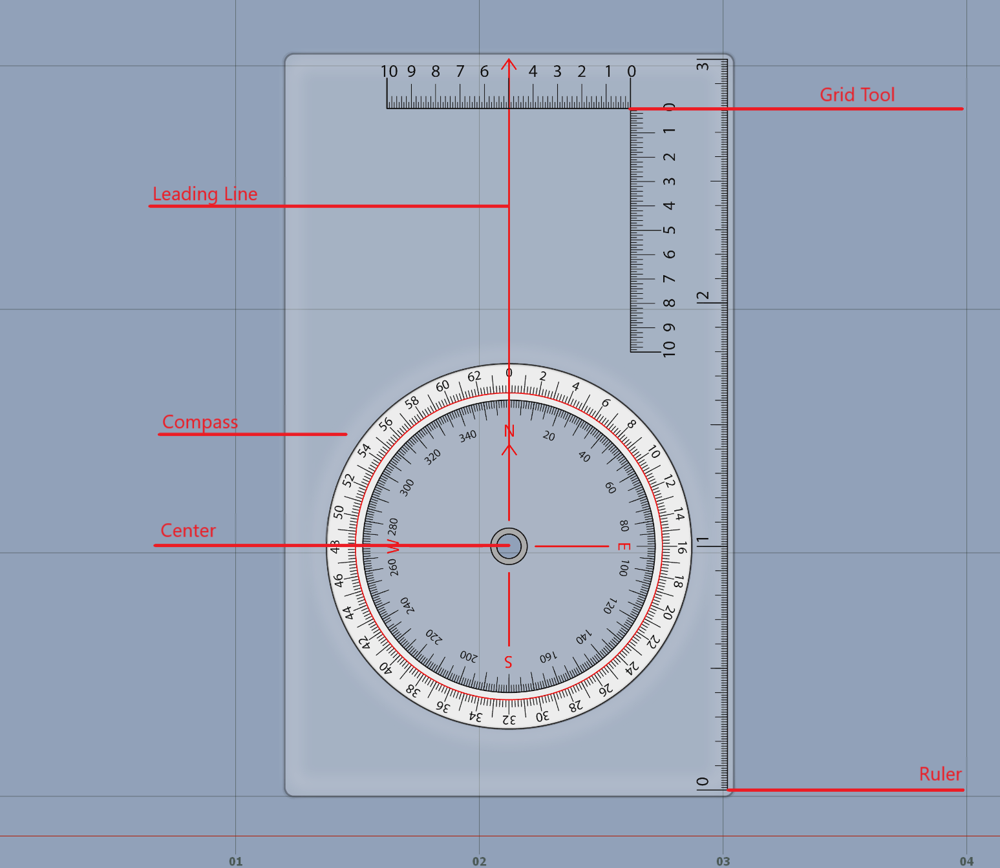

#### Features of Map Tool

##### Leading Line
A long red Line that runs long the lengh of the map

##### Grid Tool
Two rulers perpendicular (90°) to each other - used for more detailed GridReferences

##### Ruler
Used To messure Distances on the Map

##### Center
The Map tool Pivots around this center point


#### Moving the Map tool

A) Cursor over the MapTool, hold **Left Mouse Button** to drag the Tool over the Map

B) To Rotate the Map Tool, use **Left Alt Key** and **LMB** on anything outside the Maptools Compass

#### Calculating a Route Between two Points

1. Identify A and B on the Map
2. Determine Bearing - Position Point A on the CenterPoint and Rotate MapTool until the red Leadingline aligns with Point B
3. Measure Distance - Drag MapTool, without changing the Compass Direction, so Point A and B is on the Side Ruler. Read Distance - One full Step is 1.000m, devided into 100m Steps and more.    

* Assuming a man can complete 100 meters in approximately one minute, you can estimate time of travel.

---

### The Compass

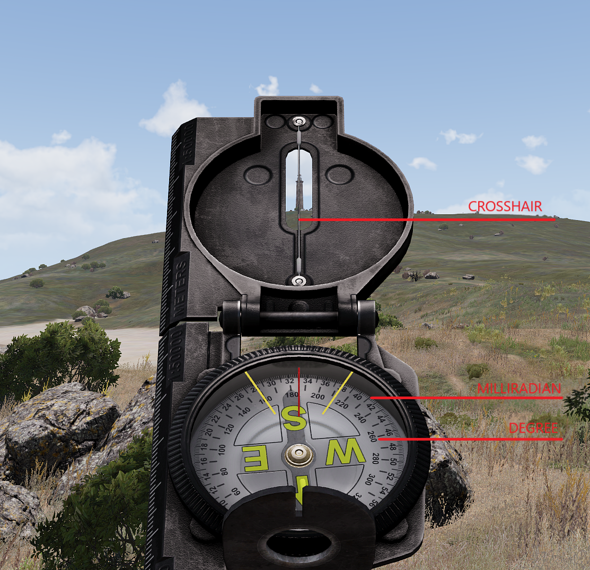

#### Degree
A compass is divided into 360 degress and is the most common unit of measurement
#### Mils
Another unit of mesurement found on a compass, used mainly by militaries in artillery, tank and mortar gunnery. Circle devided into 64 Parts.

**Sidenote:** Some Mods' Compass will only update on the Map once you took it in your hand (Used with "K")

---

### GPS, DAGR and MicroDAGR

Pretty Simple and Boring for our Class but for completionsake

#### GPS (and Drone Terminals)
- Current Position in a 6 Digit Grid Coordnate
- Altitude Above Sea Level 
- Bearing in Degrees (0°-360°)
- Access to the MiniMap Panel.

#### DAGR
Older Variant of the DAGR System:
- Current Position in a **8 Digit** Grid Coordnate
- Altitude Above Sea Level
- **Current TravelSpeed in KpH**
- Bearing in Degrees (0°-360°) or **MILS (0-6400)**
- **No access** to the MiniMap Panel.
- **Waypoint Navigation System: Bearing to Waypoint and Distance** 

#### MicroDAGR
Older Variant of the DAGR System:
- Current Position in a **10 Digit** Grid Coordnate
- Altitude Above Sea Level
- Current TravelSpeed in KpH
- Bearing in Degrees (0°-360°) or MILS (0-6400)
- No access to the MiniMap Panel.
- Waypoint Navigation System: Bearing to Waypoint and Distance 
- **Comes with its own Graphical MAP**


### Binoculars (ACE)
The Basic Binoculars in ACE come with MIL-DOT Markings.

Careful: Binocular and Periscope Mil come "10 Mils per Dot" scale 
while most if not all Rifle Scopes will have a "1 Mil per Dot" scale.

#### MIL-DOT Ranging

General MilDot Formular:
(Object Height X 1000) / Messured Mil-Dots = Distance

With Binoculars:
(Object Height x 1000) / Messured Mil-Dots x10 = Distance


### Your own Eyes

#### Path of the Sun


The picture above is a solargraph. 

Simply said, it is an analog photograph taken over the duration of one year. 
The sun has burned itself into the negative.

What you can see here therefore, is the path of the sun. At its lowest during the winter and at its hightest during the summer.

Depending on your geographical position it might vary a bit but the general idea stays the same.

The Sun rises in the east, will be at its highest point in the south and goes down in the west.

This method might not give yourself the most accurate direction but, when you stand there with nothing in your hands, you can use it for general orientation.


#### Polaris

Commonly known as the North Star or Pole Star, is the brightest star in the constellation of Ursa Minor.

It is very close to the north celestial pole, making it the current nothern pole star.

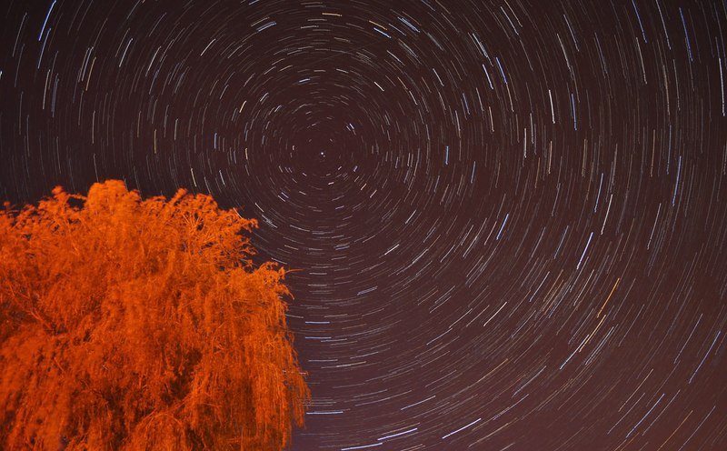
(Very) Long Exposure Time Photograph of the Nothern Sky. 
Due to the earth's rotation all stars but Polaris will have trail on this photograph. 

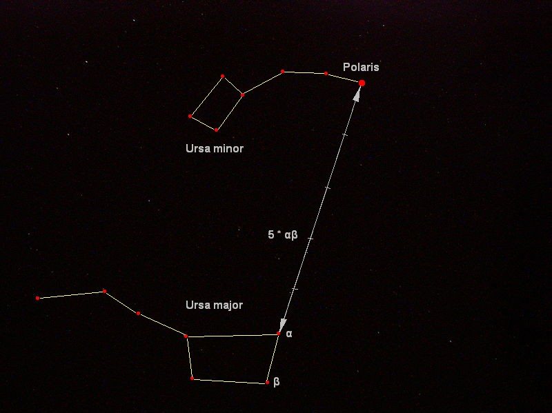

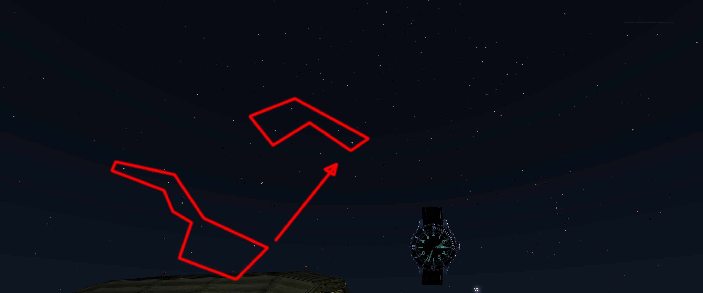

[](http://www.youtube.com/watch?v=MrnKLTmP7JI "Polaris in ArmA 3")


## Sources and References

1st Air Assault - Map Reading, Map Tools and Markers
https://www.youtube.com/watch?v=YBrmLlxgOnc

